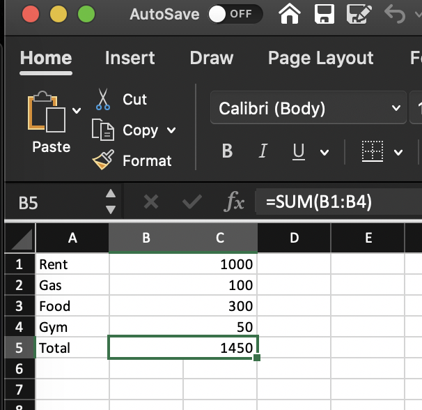
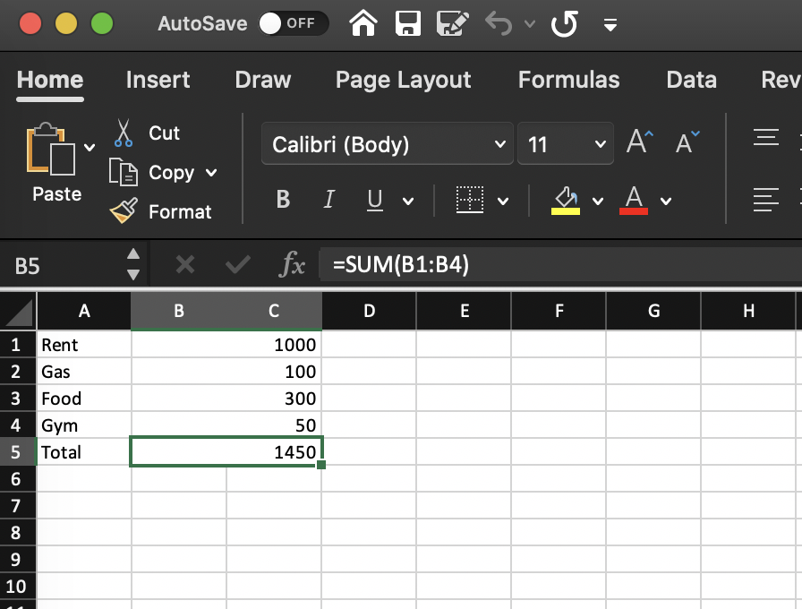
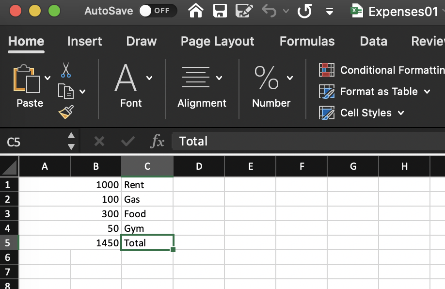
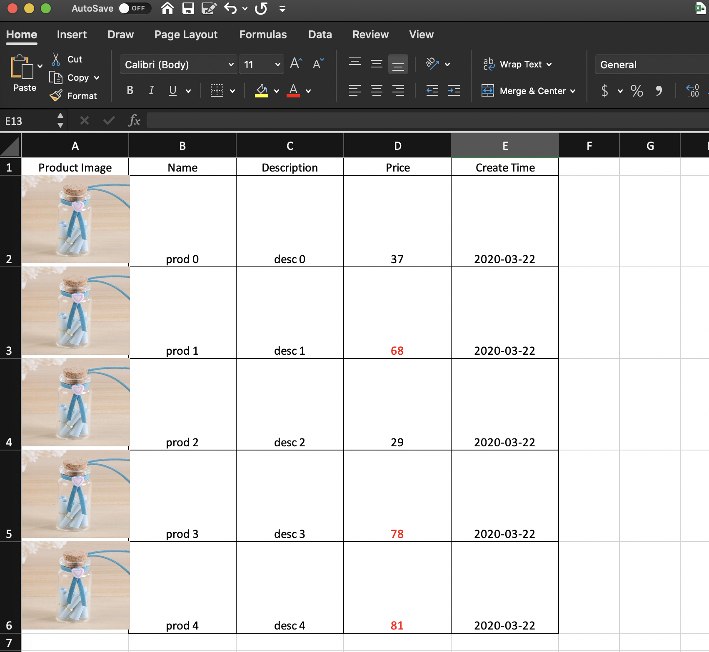
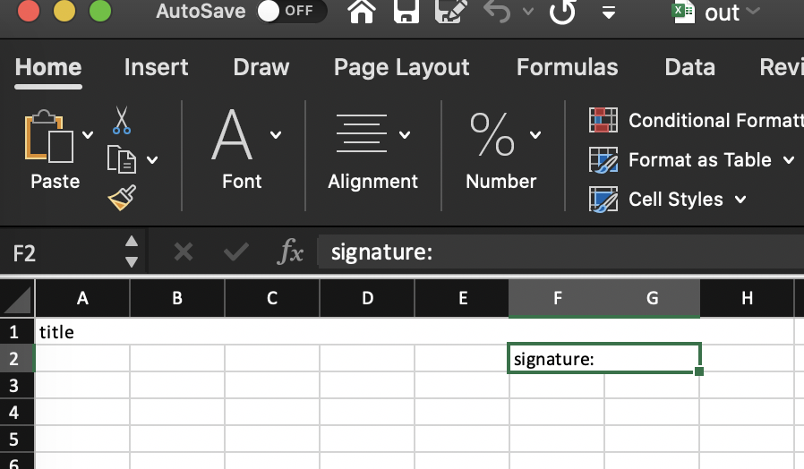

但是有经验的同学都知道，导出 Excel 表格并不是一个轻松的差事。 有时候即便是一个简单的导出商品列表的需求可能都需要大量的代码来完成，为了帮助大家从导出 Excel 的繁琐工作中解放出来，我们开发了一个声明式的 Excel 导出库 [**Poi**](https://github.com/baoshishu/poi).

## 痛点在那里？

Python 导出 Excel 通常都会使用 [XlsxWriter](https://xlsxwriter.readthedocs.io/) 这个库，通过指令式的代码在 Excel 工作簿的每个单元格写出需要的文字或图片。

```python
import xlsxwriter

# Create a workbook and add a worksheet.
workbook = xlsxwriter.Workbook('Expenses01.xlsx')
worksheet = workbook.add_worksheet()

# Some data we want to write to the worksheet.
expenses = (
    ['Rent', 1000],
    ['Gas',   100],
    ['Food',  300],
    ['Gym',    50],
)

# Start from the first cell. Rows and columns are zero indexed.
row = 0
col = 0

# Iterate over the data and write it out row by row.
for item, cost in (expenses):
    worksheet.write(row, col,     item)
    worksheet.write(row, col + 1, cost)
    row += 1

# Write a total using a formula.
worksheet.write(row, 0, 'Total')
worksheet.write(row, 1, '=SUM(B1:B4)')

workbook.close()
```



上面这段代码还是很简单的，通过遍历列表数据，我们一共输出了 4 行，每行两列。其中第一列是名称，第二列是数量。通过 `write()` 方法我们指定了在第几行第几列写入数据。可能你感觉还行。可是如果我们接到需求，数量要占两列, 代码可能会改成下面这样

```python
for item, cost in (expenses):
    worksheet.write(row, col,     item)
    worksheet.merge_range(row, col + 1, row, col+2,  cost)
    row += 1

# Write a total using a formula.
worksheet.write(row, 0, 'Total')
worksheet.merge_range(row, col + 1, row, col + 2, '=SUM(B1:B4)')
```



我们把 `write()` 方法改成了 `merge_range()`. 如果你觉得也还好，那么请思考一下：如果要把数量和名称交换顺序呢？当然这也难不倒我们:

```python
for item, cost in (expenses):
    worksheet.merge_range(row, col, row, col+1,  cost)
    worksheet.write(row, col+2,     item)
    row += 1

worksheet.merge_range(row, col, row, col + 1, '=SUM(A1:A4)')
worksheet.write(row, 2, 'Total')
```



够了！虽然我们一次又一次解决了问题，但是改动却越来越多。简单分析一下，这样的迭代过程有 4 个严重的问题：

1. `merge_range` 和 `write` 应该是同一个层级的抽象，对于业务而言，不应该总是去想一列用 `write` 多列用 `merge_range` 这个问题，而是有一个更高级别的抽象。

1. 我们的代码需要跟踪当前在的行数(row)和列数(col), 一旦需要位置变更，就需要上上面那样手动调整 row 和 col，这显然是一个极易出错的过程。

1. 即便是两列位置的交换，可能需要同时修改多个地方(`worksheet.merge_range(row, col, row, col+1, ...)`), 如果一个地方错了或者忘记了，那么输出的结果就会发生错乱。

1. 依赖公示 `=SUM(B1:B4)`, 一旦布局改变，公示也需要调整，但是实际上要表达的意思并没有改变。

## 解决方案

**Poi**

通过**声明式**的写法, 我们只需要描述出需要导出的内容，而把具体渲染的逻辑交给渲染引擎来完成，开发者专注于业务表达而不是渲染细节。使用 _Poi_， 上面的例子可以这么实现

```python
from poi import Sheet, Row, Cell

expenses = (
    ["Rent", 1000],
    ["Gas", 100],
    ["Food", 300],
)

total = (["Total", sum(r[1] for r in expenses)],)

rows = [Row(children=[Cell(row[0]), Cell(row[1]),]) for row in expenses + total]

sheet = Sheet(root=[*rows,])

sheet.write("Expenses01.xlsx")

```

这里我们构造了一个 `Sheet` 对象, 来表示导出一个工作薄，`root` 参数则是要导出的 `Rows`, 通过声明每行的内容(两个`Cell`), 清楚的表达了我们的意图。实际效果跟第一个例子一模一样。

下面我们同样进行之前的两个迭代。

### 数量增加一列

```diff
rows = [Row(
    children=[
        Cell(row[0]),
-       Cell(row[1]),
+       Cell(row[1], colspan=2),
    ]
) for row in expenses + total]

```

只需要指定数量列的 `colspan` 参数表示我们需要的列数，Poi 会自动把 `write` 方法改成对应的 `merge_range` 方法。

### 交换顺序

```diff
rows = [Row(
    children=[
-        Cell(row[0]),
-        Cell(row[1], colspan=2),
+        Cell(row[1], colspan=2),
+        Cell(row[1]),
    ]
) for row in expenses + total]
```

是不是太简单了。

## 更多高级用法

### Table

对于常用的列表导出，Poi 提供了 `Table` 组件，类似 [pandas](https://xlsxwriter.readthedocs.io/working_with_pandas.html) 的 `to_excel` 方法，直接导出列表数据，不过功能远比 pandas 的强大。

```python
from typing import NamedTuple
from datetime import datetime
import random

from poi import Sheet, Table


class Product(NamedTuple):
    name: str
    desc: str
    price: int
    created_at: datetime
    img: str


data = [
    Product(
        name=f"prod {i}",
        desc=f"desc {i}",
        price=random.randint(1, 100),
        created_at=datetime.now(),
        img="./docs/assets/product.jpg",
    )
    for i in range(5)
]
columns = [
    {
        "type": "image",
        "attr": "img",
        "title": "Product Image",
        "options": {"x_scale": 0.27, "y_scale": 0.25},
    },
    ("name", "Name"),
    ("desc", "Description"),
    ("price", "Price"),
    ("created_at", "Create Time"),
]
sheet = Sheet(
    root=Table(
        data=data,
        columns=columns,
        row_height=80,
        cell_style={
            "color: red": lambda record, col: col.attr == "price" and record.price > 50
        },
        date_format="yyyy-mm-dd",
        align="center",
        border=1,
    )
)
sheet.write("table.xlsx")
```



简单的几行代码，我们就可以导出一个商品列表!

同时我们还可以定制格式化时间，设置对齐方式, 表格宽高等等。

甚至可以直接导出*图片*!

甚至可以动态的设置每个 `Cell` 的样式(数量大于 50 的文字变成红色)!

### 精细的布局

Poi 有一定的自动计算能力，可能你不需要手动设置每个 `Cell` 的*列数*和*行数*甚至\*偏移 8，Poi 都可以帮你计算。看下面这个例子：

```python
from poi import Sheet, Row, Cell

sheet = Sheet(
    root=
    [
        Row(
            children=[
                Cell(
                    "title",
                    grow=True,
                )
            ]
        ),
        Row(colspan=8, children=[
            Cell("signature:", offset=5, grow=True),
        ],
            )
    ],
)
sheet.write('out.xlsx')
```



我们声明了第二行的列数(`colspan = 8`)。第一行只有一个 Cell ，通过 `grow` 参数使其自动填满可能的最大宽度。同时，第二行的 _signature_ 设置了 5 列的偏移量, 再通过 `grow` 填满剩下的两列。

### 细粒度的样式

通过 Poi 我们还可以给 `Row`, `Col` 和 `Cell` 设置样式，并且部分样式可以继承。具体的用法这里就不多展开了。

## Take away

Poi 的代码已经[开源](https://github.com/baoshishu/poi), 有兴趣的同学可以看看, 里面还藏有一些上面没有提到的精致的小功能。

Poi 用到了 Python3 的 [singledispatch](https://docs.python.org/3/library/functools.html#functools.singledispatch) 来实现对每个节点的访问。

用到了 [snaposhottest](https://github.com/syrusakbary/snapshottest) 来测试输出的 Excel 文件满足预期。

## 小结

如果你想给 Poi 增加更多功能和特性，欢迎 Issue 和 PR。即便你不是用的 Python 做 Excel 的导出，希望 Poi 也能给你带来一些启发。最后，如果你觉得 Poi 很酷，请不要吝惜一个点赞哦。
