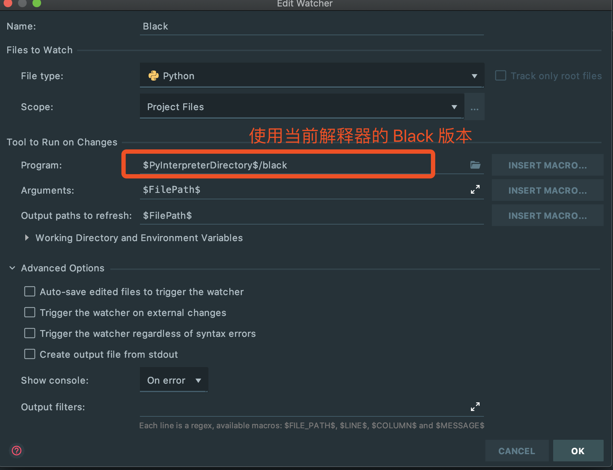

磨刀不误砍柴工。对开发者而言， 一个适合自己的开发环境是保证效率和产出的前提。下面就分享一下我是怎么搭建 Python 开发环境的，仅供大家参考。

## 安装 pyenv

[pyenv](https://github.com/pyenv/pyenv) 是一个 Python 版本管理工具，不同的项目往往使用了不同的 Python 版本（老项目甚至可能还在用 Python2）。通过 pyenv 都可以很方便的切换。

### 我们可以通过 [Homebrew](https://brew.sh/) 安装 pyenv:

```bash

# 安装 homebrew
/bin/bash -c "$(curl -fsSL https://raw.githubusercontent.com/Homebrew/install/master/install.sh)"

# 安装 pyenv

brew install pyenv


```

### 安装最新的 Python3 和 Python2 版本

```bash

pyenv install 3.8.2

pyenv install 2.7.16

```

### 常用命令

```bash
pyenv version # 列出所有已安装的 Python 版本

pyenv install $version # 安装某个版本的 Python

pyenv global  # 查看全局的 Python 版本

pyenv global $version # 修改全局的 Python 版本

pyenv shell $version # 临时修改当前 shell 的 Python 版本

```

## 安装 pipx

安装完 pyenv 后，我通过 `pyenv global 3.8.2` 设置全局的 Python 版本，然后在这个版本上安装 [pipx](https://github.com/pipxproject/pipx). pipx 是一个帮助我们集中管理 Python 命令行应用的工具。我们一般都会安装一些 Python 的命令行工具，如果直接用 `pip` 安装会有 2 个问题：

1. pip 的版本不清楚，导致安装的包环境混乱, 下面的操作会让我们同时安装 2 个版本的 _http_

   ```bash
   pyenv shell 3.8.0
   pip install http

   pyenv shell 2.7.16
   pip install http
   ```

1. 无法统一管理，不能列出当前有哪些命令行工具，集中更新、卸载。

pipx 通过创建一个独立的虚拟环境，通过 `pipx install` 安装的 Python Package 会统一放到这个虚拟环境中，实现了统一管理。

```bash
pip install pipx

# 安装一些常用的 CLI 工具

pipx install ansible
pipx install fabric
pipx install youtube-dl

# 卸载 ansible
pipx uninstall ansible

# 全部更新
pipx upgrade-all

# 更新 ansible

pipx upgrade ansible
```

## 安装 Poetry

[Poetry](https://github.com/python-poetry/poetry) 是一个集依赖管理、环境管理以及项目构建于一身的工具, 帮助我们打造一个流畅的 _workflow_.

### 通过 pipx 安装

```bash
pipx install poetry
```

### 结合 pyenv 初始化一个新项目

```bash

# 快速创建 `pyproject.toml` 配置文件
poetry init


# 使用 `pyenv global` 对应的 Python 版本创建虚拟环境
poetry install
```

### 手动选择虚拟环境的版本

某些情况我们需要选择虚拟环境的版本，比如 _tensorflow_ 目前只支持到 _Python3.6_.

```bash
pyenv install 3.6.0


mkdir my-app
cd my-app

# 切换当前shell 的 Python 环境到 3.6.0
pyenv shell 3.6.0

# 用 Python3.6.0 版本创建虚拟环境
poetry env use `which python`
poetry add tensorflow
```

### 构建项目并发布到 Pypi

```bash
poetry build
poetry publish
```

## 安装 Black 并配置 Pycharm

最后我们用 [Black](https://github.com/psf/black) 格式化代码。

```bash
# 当前项目安装 black
poetry add --dev black
```

按照 <https://github.com/psf/black#pycharmintellij-idea> 的步骤配置 Pycharm， 实现保存代码的时候自动格式化。稍有不同的是，我们设置 Black 的路径为当前项目 Python 环境安装而非全局的 _Black_.


