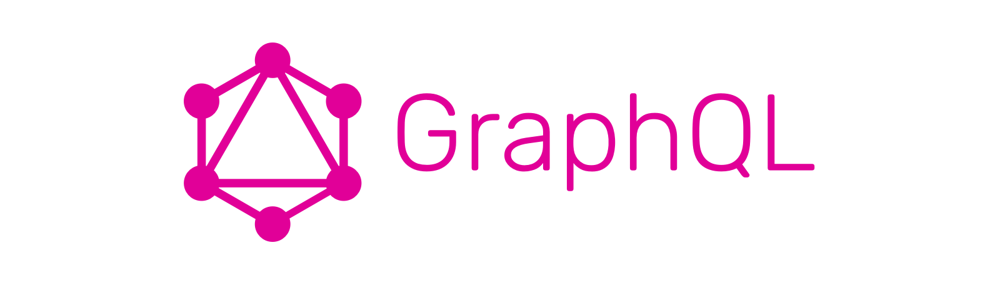
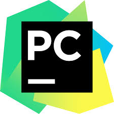
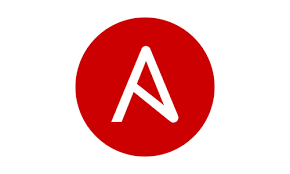
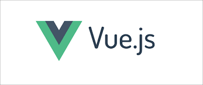
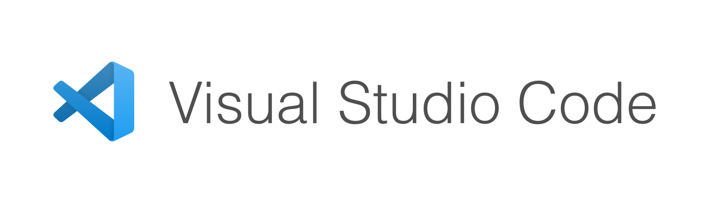
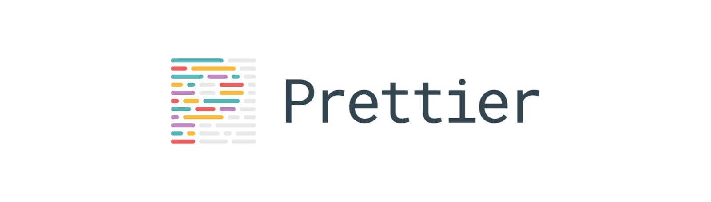
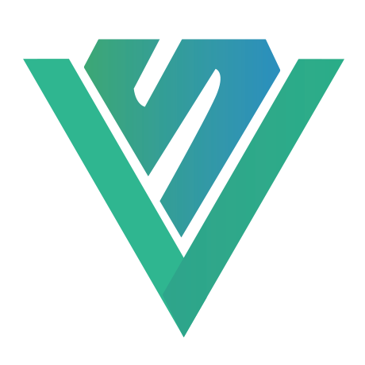
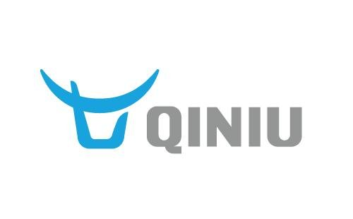

我们选择后端 _Python3.8_, 前端 _JavaScript_ 作为主要的开发语言。 经过很长时间的实践，我们认为至少在小公司的快速成长阶段，这个组合能够充分保证开发迭代的效率。下面就来分享一下我们的整个技术栈。

## 后端

### 数据库

#### MySQL

[MySQL](https://www.mysql.com/) 是我们主要使用的数据库，目前部署的是 5.7 版本, 我们认为 ACID (Atomicity, Consistency, Isolation, Durability)是保障业务稳定的根本。MySQL 的成熟与稳定则是我们青睐他的原因。某些场合我们也会使用[PostgresSQL](https://www.postgresql.org/) 来处理地理位置相关的业务, [PostGis 拓展](https://postgis.net/) 能够基本满足地理位置相关数据的存储和查询需求。

### ORM

#### SQLAlchemy

[SQLAlchemy](https://www.sqlalchemy.org/) 几乎是 _Python_ 社区 ORM 的不二选择，_SQLAlchemy_ 其实包含了 _core_ 和 _ORM_ 两个部分，_core_ 是底层对不同数据库 _DB-API_ 的封装，_ORM_ 则是在此基础之上的从数据库 **Table** 到 **Python class** 的映射，因为是业务驱动开发，我们主要使用了 _SQLAlchemy_ 的 _ORM_ 功能, _SQLAlchemy_ 还提供了[自定义数据类型](https://docs.sqlalchemy.org/en/13/core/custom_types.html#types-custom)、[事件 hook 系统](https://docs.sqlalchemy.org/en/13/orm/extending.html) 等强大的功能，可以在特定的场景发挥很好的效果。关于*SQLAlchemy*的一些实战经验, 我们后面可以开专题分享。

### Web 框架

#### Flask

无论何时用 Python 做 Web 开发，[Flask](https://palletsprojects.com/p/flask/) 都是我们的不二选择。`Flask` 只提供了一个基本的 `WSGI` App，开发起来基本没有什么束缚，想要什么功能基本都有对应的插件，即便自己写一个也是分分钟的事情。_Flask_ 的源码也很简单，推荐阅读。 用 _Flask_ 保证了我们对整个项目完全可控，业务开发过程中除了 [`Context`](https://flask.palletsprojects.com/en/1.1.x/appcontext/) 外也基本不需要思考跟 _Flask_ 本身有关的问题。

我们往往会用 [create-flask-skeleton](https://github.com/ryanwang520/create-flask-skeleton) 来迅速搭建一个新的 Flask 项目。

### API

#### GraphQL

[GraphQL](https://graphql.org/) 提供了强大的查询功能，不同的客户端（Web，App，小程序）可以使用同一套接口，根据各自的需求来查询不同的数据。在具体的使用过程中我们发现 _GraphQL_ 确实解决了 API 开发的两大痛点：

1. _GraphQL_ 自动生成了 _API Schema_ 用 [graphql-playground](https://github.com/prisma-labs/graphql-playground) 这样的工具可以直接看到接口文档并直接发起请求，后端可以把字段说明直接写在相应字段的 `description` 里面, 保持了代码和文档的同步，也省去了专门维护文档的烦恼，前端直接看 _Schema_ 文档也省去了很多沟通成本。

1. 业务需求经常发生变动，尤其是小程序经常要调整，_GraphQL_ 让我们面向数据提供接口而不是面向页面，好处是前端页面的调整往往只需要前端工程师重新*组合* 查询就可以完成。 后端的接口面向数据而不是页面大大减少了接口的维护成本。

当然，_GraphQL_ 使用过程中我们也踩了不少坑, 像我们使用的库 [Graphene](https://graphene-python.org/) 用起来需要写很多 Boilerplate 的代码。 另外 _Graphene_ 基本已经处于不活跃状态, 前景堪忧。

### 开发环境

#### Docker

[docker-compose](https://docs.docker.com/compose/) 在搭建开发环境上真的是得天独厚。一个简单的 _docker-compose.yml_ 文件就能把一个项目用到的所有服务编排好，不用我们再去本地开发机上一个一个配置 MySQL，Redis，Elasticsearch 服务。 已经 2020 年了, 我找不到一个后端开发不上 Docker 的理由。

### 工具链

#### PyCharm

Python IDE，我们只认 [PyCharm](https://www.jetbrains.com/pycharm/).

#### Poetry

我们所有的后端项目都是用 [Poetry](https://python-poetry.org/docs/) 管理项目依赖和构建，体验就两个字——**真香**。

#### Black

我们用 [Black](https://github.com/psf/black) 来格式化 Python 代码，主要目的不是为了所谓的**好看**, 而是省去对不同格式风格的无谓争论，保证大家的 _Code Style_ 在格式层面的一致。开发过程中也不需要去思考跟代码格式相关的问题而把精力专注在功能的实现上。

#### Flake8

[Flake8](https://flake8.pycqa.org/en/latest/) 是一个代码格式和错误的检查工具。因为已经有 Black 了，我们只用 Flake8 做一些简单的[错误检查](https://flake8.pycqa.org/en/latest/user/error-codes.html)。

#### Mypy

[Mypy](http://mypy-lang.org/) 是一个静态类型检查工具。我们在项目里面有限的使用了 Mypy，没有 All in 是因为 Mypy 的功能和生态都还不够强大，迭代速度也相对迟缓，IDE 支持也相当有限，使用起来远远没有 Typescript 那样得心应手的感觉。但是在有的确实需要理清系统边界, 输入输出比较复杂的场景, Mypy 还是可以帮助我们在编译期就定位到错误。

### 运维

#### Ansible

我们所有业务项目的部署代码都维护在一个 [Ansible](https://www.ansible.com/) 项目里面, 基本实现了

1. 迅速部署任意服务到新机
1. 区分 staging 和 prod 环境
1. 部署单元模块化

## 前端

### 框架

#### React

[React](https://reactjs.org) 大型的前端项目，我们首选 React。丰富的社区，对 Typescript 支持的友好， 大厂的加持都是我们信赖它的理由。具体的就不多做介绍了，参考前一篇文章 [如何开始你的下一个 React 项目
](https://blog.baoshishu.com/how-to-start-your-next-react-project)。

#### Vue.js

[Vue.js](https://vuejs.org/) 的特点是设计优雅简单，上手快，模版引擎在后台开发上有着独特的优势， 我们的后台管理项目都会优先选择 Vue 和 Element UI 的搭配，当真是屡试不爽。 虽然 _Vue3_ 还有一段时间，我们已经在项目中用上了 [Composition API](https://vue-composition-api-rfc.netlify.com/), 体验也是两个字——**真香**。

### UI 库

### Taiwind

[Tailwindcss](https://tailwindcss.com/) 是一个 `utility-first` 的 CSS 框架, 用来快速开发样式极大的提高了前端的效率，同时 Tailwind 基于 JavaScript 的主题配置, 同时提供了灵活性和一致性。缺点是不够模块化，可能和已有样式冲突等。

#### ChakraUI

[ChakraUI](https://chakra-ui.com/)是一个优秀的 React UI 框架，基于 [System UI Theme Specification](https://system-ui.com/theme/) 的规范, 一个 _CSS in JS_ UI 框架的集大成者, 容易拓展。

#### ElementUI

[ElementUI](https://element.eleme.cn/) 比较符合国内用户的审美，所以用来做后台开发真的是再合适不过了。

### 工具链

#### Visual Studio Code

[VSCode](https://code.visualstudio.com/) 简直就是一个专为前端开发而设计的一个编辑器, 功能强大。

- 通过 [Language Server](https://code.visualstudio.com/api/language-extensions/language-server-extension-guide#why-language-server) 提供了错误检查，自动跳转，自动补全等 IDE 的功能。

- 和前端社区紧密绑定，优秀的前端工具往往都有对应的 VSCode 插件，也往往会在第一时间更新。

- 很多漂亮实用的主题，推荐 [Night Owl](https://marketplace.visualstudio.com/items?itemName=sdras.night-owl]).

#### Yarn Workspace

[Yarn Workspace](https://classic.yarnpkg.com/en/docs/workspaces/) 可以让我们把多个相关的项目放到一个 Git Repository 里面统一管理，还能实现部分代码的复用，比直接开多个 Repository 维护起来要方便很多。

#### Prettier

同 Black, 用 Prettier 也是因为再也不用去想代码格式的问题, 节省时间和脑力

> Just write code and let Prettier fix it.

#### ESlint

[Eslint](https://eslint.org/) 是用来检查代码是否有错误以及潜在的错误的工具。通常我们会给 ESlint 配置一些规则。不过请记住如果某个 _lint 规则_ 对代码质量和检查错误没有任何帮助，请立即删掉它，比如 [no-console](https://eslint.org/docs/rules/no-console) 这种规则就完全没有意义。

## 小程序

### Mpvue

我们使用 [mpvue](https://github.com/Meituan-Dianping/mpvue) 进行小程序开发, 并对开发环境和构建过程做了一定的定制, 比如支持 _Prettier_, _Yarn Workspace_ 和*智能分包*。虽然 _mpvue_ 项目已经基本没有人维护, 但是目前而言基本也能满足业务开发需求。

还是不禁感叹小程序的生态圈感觉真的乱七八糟。腾讯如果能把开发者的游戏体验看重一点，自己把底层框架和工具链做扎实，哪用得着搞出这么多小程序框架。

## CDN

### 七牛

#### Bucket

七牛的 Bucket 用来存储图片等小文件是一个不错的选择，价格低廉，性能稳定, 支持图片剪裁和原图保护。缺点是不能自定义 Nginx 规则，比方你没有办法把一个 _Vue CLI_ 构建的项目直接丢到一个 Bucket 上面就能成功部署(如果你觉得可以，欢迎挑战)。

#### 回源 CDN

为了解决 Bucket 不能自定义 Nginx 的规则, 我们还是把前端代码先部署到自己的服务器上，通过配置 CDN 回源规则来让七牛从我们自己的服务器上抓取静态资源文件。

## 小结

以上的用到的技术方案让我们可以高效完成开发任务。 当然很大程度上也是我们主观的选择，而且我们也会在以后的开发过程中进行其他尝试，同时我们也希望听听你的建议。
